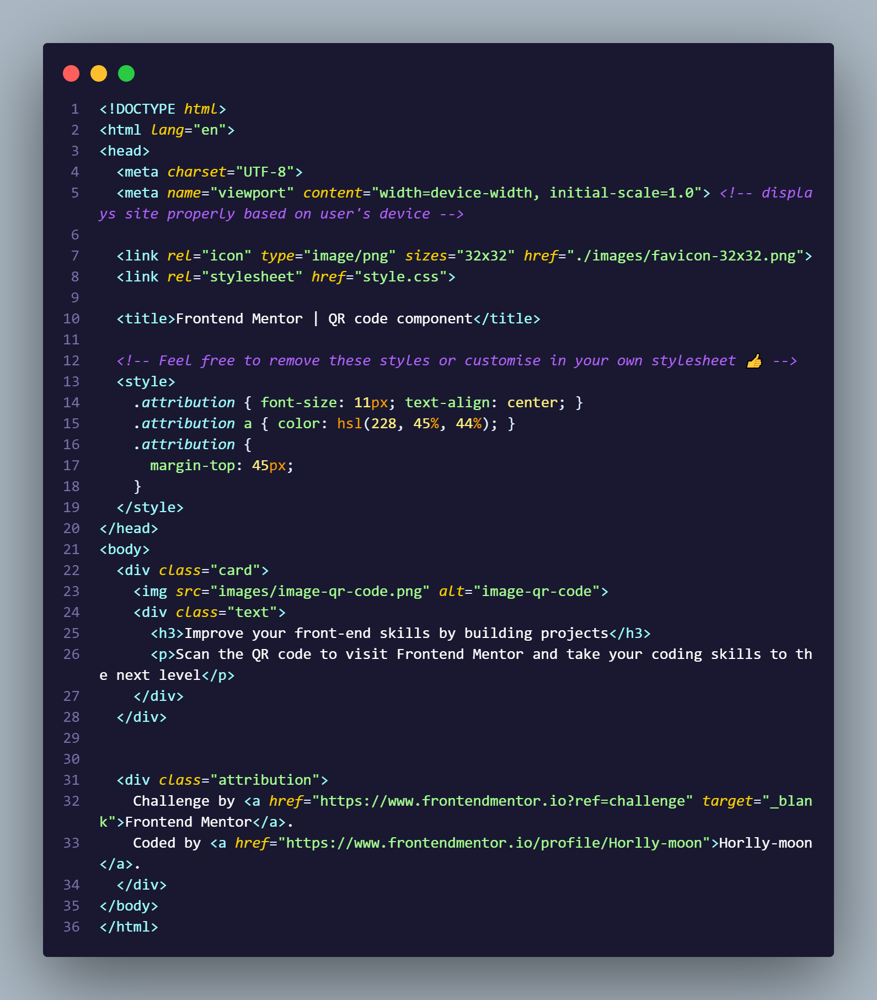
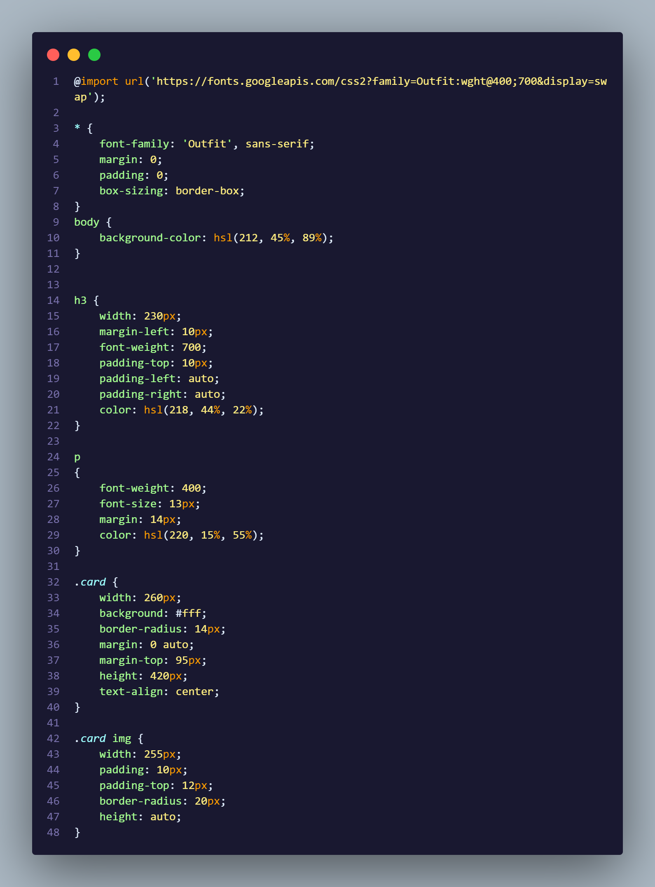

# Frontend Mentor - QR code component solution

This is a solution to the [QR code component challenge on Frontend Mentor](https://www.frontendmentor.io/challenges/qr-code-component-iux_sIO_H). Frontend Mentor challenges help you improve your coding skills by building realistic projects. 

## Table of contents

- [Overview](#overview)
  - [Screenshot](#screenshot)
  - [Links](#links)
  - [Built with](#built-with)
  - [What I learned](#what-i-learned)
  - [Continued development](#continued-development)
- [Author](#author)


## Overview
This is a Qr Code Component Project given by Frontend Mentor

### Screenshot





### Links

- Solution URL: [Solution](https://github.com/Horlly-moon/qr-code-component.git)
- Live Site URL: [Add live site URL here](https://your-live-site-url.com)


### Built with

- Semantic HTML5 markup
- CSS
- Margin
- Padding


### What I learned
I learnt how to make use of the margin and padding in CSS.

```css
.card {
    width: 260px;
    background: #fff;
    border-radius: 14px;
    margin: 0 auto;
    margin-top: 95px;
    height: 420px;
    text-align: center;
}
```

### Continued development

I am still having a little bit of problem on how and when to us it. Hopes of getting a feedback in this project will sure be alot of help in improving my coding skills.


## Author

- Website - [Add your name here](https://www.your-site.com)
- Frontend Mentor - [@Horlly-moon](https://www.frontendmentor.io/profile/Horlly-moon)
- Twitter - [@yourusername](https://www.twitter.com/yourusername)

